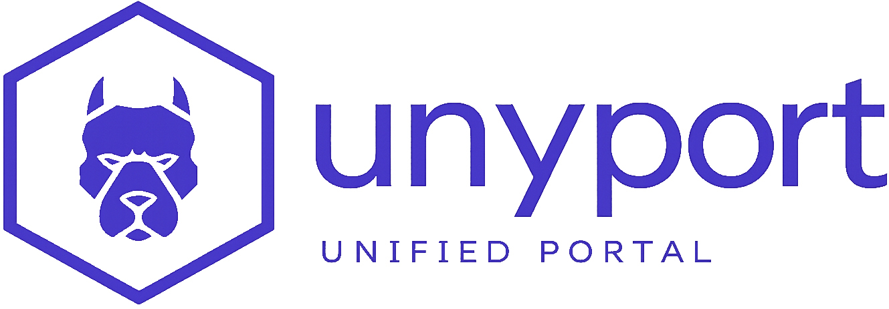
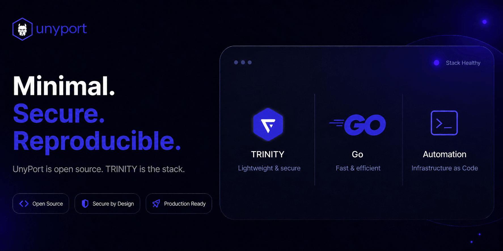
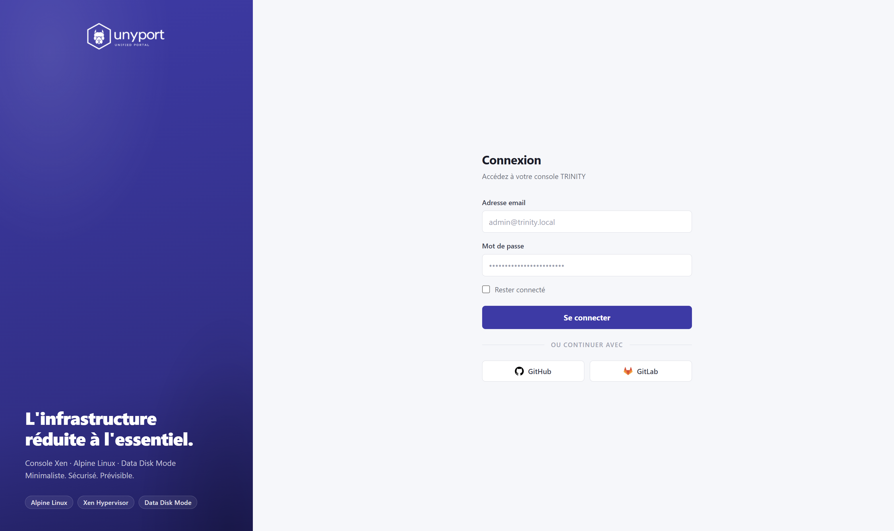
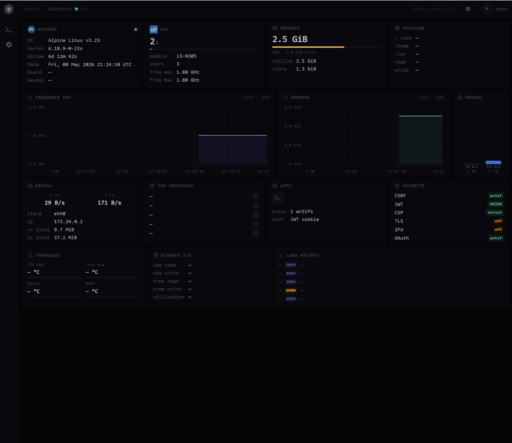
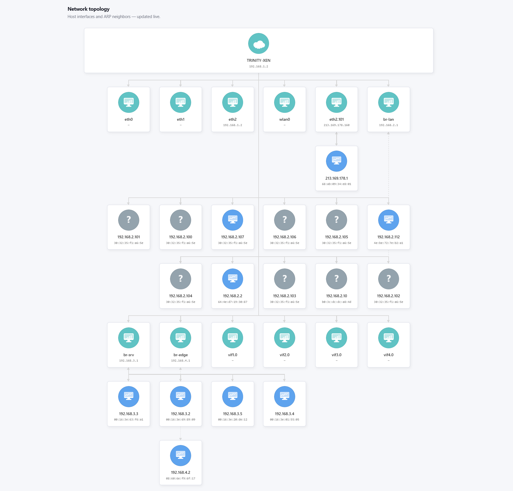

<div align="right">



</div>

<br><br>

<div align="center">



</div>

<br><br>

# UnyPort (Beta)

**Unified sysadmin portal in Go — for Alpine Linux & Xen**

`Go` `Single Binary` `Single Port` `Xen-aware` `Data Disk Mode` `OAuth`

**Open source forever. No premium roadmap.**  
UnyPort stays open source: no “pro” lock-in, no future premium tier.  
Paid services are limited to **support/integration/operations by TRINITY**.

<br><br>

<div align="center">



</div>


→ **[dashboard.trinity-net.com](https://dashboard.trinity-net.com)**

Legacy URL note: the previous address **dashboard.trinity-net.com** is still active.

<br>

🟪 **What is UnyPort**

UnyPort is a real-time system administration portal built in Go.
Single binary. Single port. Zero runtime dependency.

Designed specifically for Alpine Linux running in Data Disk Mode on Xen Type-1 hypervisors.
Every metric is read directly from the kernel — no agent, no daemon, no bloat.

Built in pure Go for deterministic deployment and low operational overhead on constrained hosts.
The roadmap is intentionally split:

- **V1 (current): Monitoring-first control plane**  
  live host metrics, security posture, service/process visibility, and Xen-aware context.
- **V2: Native orchestration layer**  
  VM lifecycle and mobility workflows built on Data Disk Mode primitives (`xl`, `xl migrate`) rather than a XenAPI abstraction layer.

In that model, **Data Disk Mode + `xl migrate`** is treated as a practical next-gen control plane approach ("xenapi.ng"): simpler, auditable, and aligned with minimal Dom0 operations.

UnyPort is also the continuation of the Alpine ACF effort I contributed to for official Alpine Linux workflows.  
That project is archived on Codeberg: [codeberg.org/trinity-labs/official](https://codeberg.org/trinity-labs/official).

---

<br>

⬛ **Features**

| Module | Description |
|---|---|
| **System** | OS, kernel, uptime, board info — live |
| **CPU** | Per-core frequency, load, model |
| **Memory** | Used / total, real-time graph |
| **Network** | Interface, IP, RX/TX rates, totals |
| **Storage** | Disk I/O — sda, nvme read/write |
| **Processes** | Top processes by resource usage |
| **Security** | CSRF, JWT, CSP, TLS, 2FA, OAuth status |
| **Logs** | Recent system logs with severity |
| **Thermal** | CPU pkg, core avg, board, NVMe temps |
| **Apps** | Proxy status, active connections |
| **Xen** | Dom0/DomU detection, VM lifecycle |

---

<br>

⬛ **Architecture**

| Layer | Detail |
|---|---|
| **Runtime** | Single Go binary — musl compatible |
| **Transport** | Single port — HTTP/2 + WebSocket |
| **Auth** | OAuth GitHub · OAuth GitLab · JWT HS256 |
| **Security** | CSRF · CSP strict · TLS · 2FA ready |
| **Metrics** | Direct kernel reads — /proc · /sys |
| **State** | Stateless — compatible Data Disk Mode |
| **Hypervisor** | Xen Type-1 aware — Dom0 detection |

---

<br>

⬛ **Why not Cockpit · Netdata · Portainer**

| | UnyPort | Cockpit | Netdata | Portainer |
|---|:---:|:---:|:---:|:---:|
| **Single binary** | ✓ | ✗ | ✗ | ✗ |
| **No systemd** | ✓ | ✗ | ✗ | ✓ |
| **musl / Alpine native** | ✓ | ✗ | Partial | Partial |
| **Data Disk Mode** | ✓ | ✗ | ✗ | ✗ |
| **Xen-aware** | ✓ | ✗ | ✗ | ✗ |
| **Single port** | ✓ | ✗ | ✗ | ✗ |
| **Zero agent** | ✓ | ✗ | ✗ | ✓ |

---

<br>

⬛ **Quick Start**

```sh
# Clone
git clone https://codeberg.org/trinity-labs/unyport.git
cd unyport

# Run with Docker
docker compose up -d

# Or build natively on Alpine Linux
cd unyport
go build -o unyport .
./unyport
```

Access : `https://your-host:PORT`

---

<br>

⬛ **Live Demo**

```
Running on TRINITY infrastructure — Alpine Linux v3.23.4 · Xen Type-1 · Data Disk Mode
Host    :  TRINITY Dom0
Kernel  :  6.18.33-0-lts
Memory  :  103M / 210M
Uptime  :  6d 12m
```

**Demo credentials**

```text
Email    : demo@unyport.app
Password : aUniC0rnForUnyPort!
```

**Also available:** a **VM-on-demand demo** on [trinity-net.com](https://trinity-net.com), including **French Alpine Linux support** context and workflows.

<br><br>

<div align="center">



<br><br>



</div>

→ [demo.unyport.app](https://demo.unyport.app)

---

<br>

⬛ **Part of TRINITY Edge Network**

UnyPort is only a small part of the TRINITY stack.

TRINITY also covers the underlying platform:
- minimalist and resilient Xen hypervisor operations (Dom0/DomU)
- low-power hardware strategy and edge deployment constraints
- Alpine-based sovereign infrastructure components beyond UnyPort

→ [trinity-net.com](https://trinity-net.com)
→ [gitlab.alpinelinux.org/trinity-labs](https://gitlab.alpinelinux.org/trinity-labs)

<br>

<div align="center">

*Contributor @ Alpine Linux · Est. 2020 · Versailles, France*

**A system you understand is a system you control.**


</div>
